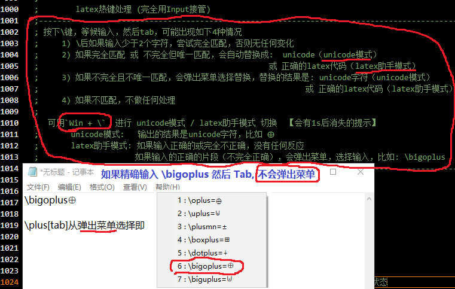
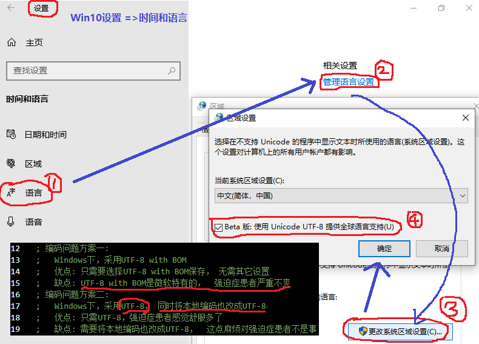

# ahklib - AutoHotkey效率脚本

> 效率脚本库，根据需要逐步添加

## 中英文切换辅助

> 关于当前上下文的特定输入法的内部中英文状态，现状是不存在可用的API获取方法。
> 
> 上一个版本，通过主动拦截记录中英文状态。缺点是有时存在记录中英文状态和实际的中英文状态不同步。
> 
> 最新版本，分别对中英文两种状态进行截图，然后根据屏幕搜图的方法获取当前上下文的中英文状态
>
> 优点是，通用性极强，适用于任意输入法内部中英文切换，也适用于两个输入法的切换（比如中文键盘和英文键盘间的切换）。
>
> 缺点是，第一次切换前需要截图，如果截图不正确，会提示重新截图。


### 假设 或 前置要求

- 假设中英文状态，必须在屏幕上可见（因为本功能依赖屏幕搜图）

- 中英文状态的截图必须能明确区分中英文状态

- 本功能默认 `Ctrl+Space` 进行中英文切换，当然你可以通过ini配置文件修改成您需要的切换快捷键

### 启动

> 建议配置成开机启动

```powershell
git clone https://github.com/chaoskey/ahklib.git

# 需要先安装AutoHotkey
autohotkey.exe IMSwitch.ahk
# 或者  下载 https://github.com/chaoskey/ahklib/releases
IMSwitch.exe
```

### 配置

默认情况下，程序启动后，会在程序或脚本目录下生成同名ini配置文件。 配置文件一旦生成，将以配置文件为准（可以手工修改指定）。

```ini
[ImSwitch]
; 中英文切换快捷键
SwitchKey=^Space
;
; *50 表示每个像素颜色红/绿/蓝通道强度在每个方向上允许的渐变值
; 更多设置，参考ImageSearch方法的参数ImageFile说明
; https://www.autoahk.com/help/autohotkey/zh-cn/docs/commands/ImageSearch.htm
; 
; 英文状态截图
EN=*50 E:\Work\GitHub\ahklib\EN.png
; 中文状态截图
CH=*50 E:\Work\GitHub\ahklib\CH.png
;
; key部分以HotKey开头，表示热键
; value中##前的部分：执行的动作，
; value中##后的部分：1表示中文时执行切换，0表示英文时执行切换，-1表示不进行中英文切换
; 确保下面的中英文切换快捷键^{Space}和前面SwitchKey的设置一致
HotKey~+4=^{Space}{bs}{Text}$##1
HotKey~Esc=^{Space}##1
HotKey~+;=^{Space}{bs}{Text}:##1
;
; key部分以HotStr开头，表示热字串，要求和前面的规则一致
HotStr:*?:;zh=^{Space}##0
HotStr:*?:;en=^{Space}##1
;
```

## 基于LaTeX的Unicode特殊字符触发

> 用处1【默认, latex助手模式】: 用于纯latex输入。 
>
> 用处2【unicode模式】: 代码中（比如: 注释，甚至变量）使用unicode特殊字符。
>  
> 也可以在任何文本框输入, 只要想的起正确的局部片段即可.
>
> 参考Katex:  https://katex.org/docs/supported.html

### 启动

> 建议配置成开机启动

```powershell
git clone https://github.com/chaoskey/ahklib.git
# 需要先安装AutoHotkey
autohotkey.exe LaTeXHelper.ahk

# 或者  下载 https://github.com/chaoskey/ahklib/releases
LaTeXHelper.exe
```

### 配置

默认情况下，程序启动后，会在程序或脚本目录下生成同名ini配置文件。 配置文件一旦生成，将以配置文件为准（可以手工修改指定）。

```ini
[LaTeXs]
; LaTeX热键触发表
CVS=E:\Work\GitHub\ahklib\latexs.cvs

```

其中，latexs.cvs，如果不存在，也会自动生成，同样一旦生成将以该文件提供的数据为准（可以手工添加修改）。

### 用法 

1）能想起字符片段，可以用`\[片断字符串][TAB]`，可能会弹出菜单，然后选择输入

2）如果没有替换说明: （Unicode模式下）完全错误 或 不支持； （latex助手模式下）输入完全正确 或 完全错误 或 不支持

3）非TAB终止符触发（比如: `[Space][Enter][Esc]`等等），表示放弃触发, 并且保持已输入的原样

4）用`Win + \`  进行 unicode模式 / latex助手模式 切换  【会有1s后消失的提示】

5）建议设置本脚开机启动

6）注意: 启动后的第一次触发，需要加载数据，可能有1s的延迟。



### 范例

> 20211128 新增一批latex助手模式下的latex块（比如，矩阵，多行公式）的支持 ，比如`\matrix[tab]`(直接触发)或`\matri[tab]`(弹出菜单选择触发)
>
> 20211128 将`latex助手模式`设置为默认

只支持单字符的LaTeX触发（目前支持如下6类）

| 分类 | LaTeX | Unicode | 说明 |
| ---- | ---- | ---- | ---- |
| 1.下标 | _n[TAB] | ₙ | 下标触发 |
| 2.上标 | ^n[TAB] | ⁿ | 上标触发 |
| 3.单字符 | \alpha[TAB] | α | 单字符触发 |
| 4.字体 | \mathbbR[TAB]  | ℝ | 空心字符触发 |
| 4.字体 | \mathfrakR[TAB] | ℜ | Fraktur字符触发 |
| 4.字体 | \mathcalR[TAB] | 𝓡 | 花体字符触发 |
| 5.组合 | R\[组合字符][TAB] 比如R\hat[Tab] | R̂ | 组合字符触发 |
| 6.片段搜索 | \[片断字符串][TAB] | 可能弹出菜单 | 搜索字符触发 |

### unicode模式/latex助手模式

可用`Win + \`  进行 unicode模式 / latex助手模式 切换  【会有1s后消失的提示】

unicode模式:   输出的结果是unicode字符，比如 ⨁

latex助手模式: 如果输入正确的或完全不正确，没有任何反应； 如果输入的正确的片段（不完全正确），会弹出菜单，选择输入，比如: \bigoplus

### 组合字符触发

> 重音符  https://katex.org/docs/supported.html#accents

| LaTeX | Unicode |
| ---- | ---- |
| R\hat[Tab] | R̂ |
| R\dot[Tab] 或 R\\.[Tab] | Ṙ |
| R\ddot[Tab] 或 R\\"[Tab] | R̈ |
| R\tilde[Tab] 或 R\\~[Tab]  | R̃ |
| R\bar[Tab] | R̄ |
| R\mathring[Tab] 或 R\r[Tab] | Rͦ |
| R\acute[Tab] 或 R\\'[Tab] | Ŕ |
| R\breve[Tab] 或 R\u[Tab] | R̆ |
| R\check[Tab] 或 R\v[Tab] | Ř |
| R\grave[Tab] 或 R\\`[Tab] | R̀ |
| R\underbar[Tab] | R̲ |
| R\H[Tab] | R̋ |

### 搜索字符触发

> 按下\键，等候输入，然后tab，可能出现如下5种情况:

- \后如果输入少于2个字符，可能是前面5类情况之一， 直接触发

- 如果完全匹配，就是前面5类情况之一， 直接触发

- 如果不完全匹配，但只有唯一匹配， 直接触发 

- 如果不完全匹配，并且不唯一，弹出菜单选择触发 

- 如果不匹配，不做任何处理  

### 关于UTF-8的编码问题

由于本工具输出的是unicode编码，如果编码不对可能会有问题。

如果您遇到了编码问题，请看下图的解决方案。



## Ctrl功能增强

首先，保证系统原生Ctrl功能不变（Ctrl未松开执行的命令）

- 【系统复制】`Ctrl + c`

- 【系统粘贴】`Ctrl + v`

- 【系统剪切】`Ctrl + x`

其次，新增截图的复制粘贴功能（Ctrl未松开执行的命令）

- 【截图复制】`Ctrl + cc`    鼠标选择屏幕上任何矩形区域（先Ctrl+cc，后选择）

- 【图片粘贴】`Ctrl + vv`    鼠标选择粘贴屏幕任意位置，也可以将复制文本作为图片粘贴  （先Ctrl+cc，后选择）

最后，增加 Clipboard浏览管理（Ctrl未松开执行的命令）

- 【下一个clip浏览】  `Ctrl + vs`

- 【上一个clip浏览】  `Ctrl + vf`

- 【删除当前clip】       `Ctrl + vd`

- 【删除全部】           `Ctrl + va`

组合命令（Ctrl松开）

- `Ctrl + c[a|s|d|f]*  = Ctrl + c`      

- `Ctrl + v[a|s|d|f]*  = Ctrl + v`

- `Ctrl + c[a|s|d|f]*c  = Ctrl + cc`

- `Ctrl + v[a|s|d|f]*v  = Ctrl + vv`