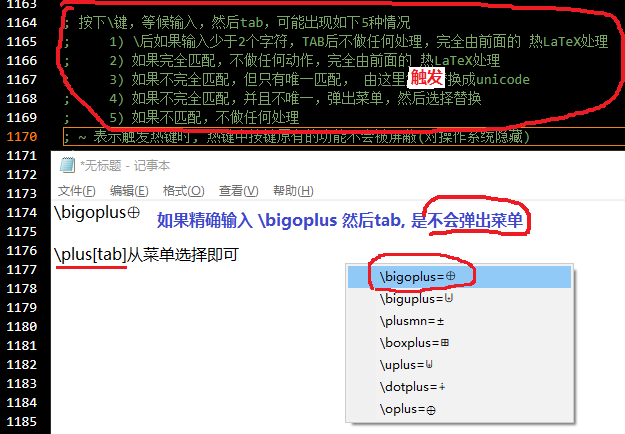

# ahklib - AutoHotkey效率脚本

> 效率脚本库，根据需要逐步添加

## 微软输入中英文切换辅助

> 微软拼音输入法中英文状态同步记录，为每一个活动过的窗口记录中英文状态， 据此进行中文切换

**假设 或 前置要求**：

- 输入法采用微软拼音并且默认为英文

- 建议本脚开机启动

- 管住手，禁止鼠标点击切换中英文 【如果提示和系统显示不一样，才能通过鼠标切换来保持同步】

**启动**:  【建议配置成开机启动】

`autohotkey.exe im_switch.ahk` 或 `autohotkey.exe main.ahk`(包括本项目所有脚本)

## 基于LaTeX的Unicode特殊字符触发

> 用处1【unicode模式】: 代码中（比如: 注释，甚至变量）使用unicode特殊字符。 当然也可以在任何文本框输入。
>
> 用处2【latex助手模式】: 用于纯latex输入，只要想的起正确的局部片段即可。 
>
> 参考Katex，尽可能使用LaTeX触发出对应的Unicode字符，适用于任何文本框，只支持字符逐个输入。
>
> https://katex.org/docs/supported.html

### 假设 或 前置要求

- 如果你想在代码中（比如: 注释，甚至变量）使用unicode特殊字符

- 使用者熟练使用LaTeX语法

- 如果不太熟练LaTeX，但能想起字符片段，可以用`\[片断字符串][TAB]`，可能会弹出菜单，然后选择输入

- 建议本脚开机启动

### 启动

> 建议配置成开机启动

```powershell
git clone https://github.com/chaoskey/ahklib.git

# 需要安装AutoHotkey
autohotkey.exe latex2unicode.ahk
# 或 所有脚本
autohotkey.exe main.ahk
```

### 用法 

1) 只对不方便键盘输入的字符进行latex[TAB]替换， 如果没有替换说明输入错误或不支持

2) 非TAB终止符触发（比如: `[Space][Enter].[Esc]`等等），表示放弃触发, 并且保持已输入的原样

3) 用`Win + \`  进行 unicode模式 / latex助手模式 切换  【会有1s后消失的提示】



### 范例

只支持单字符的LaTeX触发（目前支持如下12类）

| LaTeX | Unicode | 说明 |
| ---- | ---- | ---- |
| _n[TAB] | ₙ | 下标触发 |
| ^n[TAB] | ⁿ | 上标触发 |
| \alpha[TAB] | α | 单字符触发 |
| \mathbbR[TAB]  | ℝ | 空心字符触发 |
| \mathfrakR[TAB] | ℜ | Fraktur字符触发 |
| \mathcalR[TAB] | 𝓡 | 花体字符触发 |
| \hatR[TAB] | R̂ | 戴帽字符触发 |
| \dotR[TAB] | Ṙ  | 上单点字符触发 |
| \ddotR[TAB] | R̈  | 上双点字符触发 |
| \tildeR[TAB] | R͂  | 波浪字符触发 |
| \barR[TAB] | R̄  | 上横杠字符触发 |
| \[片断字符串][TAB] |  | 搜索字符触发 |

### unicode模式/latex助手模式

可用`Win + \`  进行 unicode模式 / latex助手模式 切换  【会有1s后消失的提示】

unicode模式:   输出的结果是unicode字符，比如 ⨁

latex助手模式: 如果输入正确的或完全不正确，没有任何反应； 如果输入的正确的片段（不完全正确），会弹出菜单，选择输入，比如: \bigoplus

### 搜索字符触发

> 按下\键，等候输入，然后tab，可能出现如下5种情况:

- \后如果输入少于2个字符，可能是前面11类情况之一， 直接触发

- 如果完全匹配，就是前面11类情况之一， 直接触发

- 如果不完全匹配，但只有唯一匹配， 直接触发 

- 如果不完全匹配，并且不唯一，弹出菜单选择触发 

- 如果不匹配，不做任何处理  

