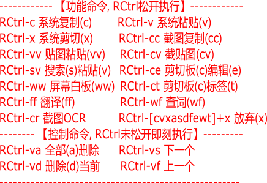

# Ctrl功能增强

> 本工具是[SharpKnife(利刃)](../README.md)效率工具库的成员
>
> 20211225  “划词翻译”优势在大段谷歌翻译，“沙拉查词”优势在查词，所以两者我都要。 此外“沙拉查词”通过设置可以保证谷歌浏览器进程一旦启动就不会退出，所以我基于“划词翻译”的相关谷歌浏览器进程维护代码就没有存在的必要的（全部删除）。 RCtrl-ff是“划词翻译”，如果没有选择弹出空的翻译窗口，如果选择了文本则翻译之；RCtrl-wf是“沙拉查词”，如果没有选择弹出空的查词窗口，如果选择了文本则查词之。 经过特别的设置，在本程序（脚本）的加持下，可以在任何位置对所选文本进行“翻译”或“查词”。
>
> 20211223, 彻底解决由于权限问题导致的脚本启动和程序运行问题。1) 首先本程序(脚本)必须以管理员身份运行（否则可能会在高权限窗口操作失效）；2） 谷歌浏览器必须在普通权限下运行（否则本程序运行后无法打开谷歌浏览器）；3）强制Snipaste也以管理员身份运行（否则可能会在高权限窗口操作失效）。
>
> 20211221, 在任意任何窗口选择文本然后Ctrl-sf翻译（需要谷歌浏览器和划词翻译扩展支持）
>
> 20211220, 彻底解决调用Snipaste作为剪切板历史浏览工具的稳定性问题。
>
> 20211218, 将自写简陋截图贴图功能，改成调用Snipaste软件实现，功能突然变强大（我这是投机取巧哦！）。


## 启动

> 建议配置成开机启动
>
> 为了可在任何窗口下运行CtrlRich.exe 或 SharpKnife.exe，脚本强制以管理员身份运行。（比如: Ctrl-cf是选择翻译，如果是非管理员状态，有些环境会触发搜索快捷键Ctrl-f；用管理员身份运行可以避免这个问题: Ctrl-cf不会触发Ctrl-f搜索，只有Ctrl-f才能触发搜索）

```powershell
git clone https://github.com/chaoskey/SharpKnife.git
# 需要先安装AutoHotkey
autohotkey.exe CtrlRich.ahk

# 或者  下载 https://github.com/chaoskey/SharpKnife/releases
CtrlRich.exe
```

## 基本说明

一般情况（没有用此脚本的情况）， `Ctrl-[任意单个字母]`， Ctrl按下、然后字母按下（哪怕都没松开）就会立刻触发。

我现在希望增强RCtrl功能（用此脚本的情况），目前已增强的操形如: `RCtrl-[cvxsdafewt]+`, **RCtrl按下后必须松开才触发，每个字母必须是一次完整的点击(按下-松开)**。 如果RCtrl按下未松开的状态下，按下的字母键未松开，会等待该字母键松开，确保是一次完整点击。

`[cvxsdafewt]+`的含义是使用正则表达式描述的，意思是：`[cvxsdafewt]`代表一个特定字母(`cvxsdafewt`之一), 而`+`代表至少一个字母点击。

这说明，只有`RCtrl-[cvxsdafewt]+`相关的Ctrl功能被增强，除此之外没有任何影响或改变。

之所以增强RCtrl功能，是因为我和大部分人都是“右撇子”；同样道理，这些特殊字字母`cvxsdafewt`选用是因为它们都在键盘左边（如前图）。 “一左一右”符合快捷操作的习惯。

如果是`RCtrl+[单字符]` = `RCtrl-[cvxsdafewt]`, 本脚本保证RCtrl松开后不改变系统的默认操作结果（当然本脚本可能会有额外的记录或动作，但不影响系统结果）。

`RCtrl`按下但尚未松开时， 可以反复输入字符`[cvxsdafewt]`，相关能触发特定动作的命令，我称之为【控制命令】。

`RCtrl`按下然后松开后，才触发特定动作的命令，我称之为【功能命令】。

注意：所有【控制命令】字符，在`RCtrl`松开后都会消失，留下的字符才可能成为【功能命令】的一部分。

## 命令列表

首先是功能命令，RCtrl松开后执行

- `RCtrl-[cvx]`     系统复制(c)粘贴(v)剪切(x) 【复制和剪切的内容会被作为历史记录】

- `RCtrl-cc`        截图复制(cc) 【需要Snipaste支持，截图的内容会被作为历史记录】

- `RCtrl-vv`        贴图粘贴(vv) 【需要Snipaste支持】

- `RCtrl-cv`        截贴图(cv) 【需要Snipaste支持，截图的内容会被作为历史记录】

- `RCtrl-sv`        搜索(s)粘贴(v) 【搜索剪切板历史记录】

- `RCtrl-ce`        剪切板(c)编辑(e) 【目前只支持文本剪切板编辑】

- `RCtrl-ww`        屏幕白板(ww) 【需要Snipaste支持】

- `RCtrl-ct`        剪切板(c)标签(t) ,可修改标签

- `RCtrl-ff`        翻译(ff) 【需要谷歌浏览器和划词翻译插件支持】

- `RCtrl-wf`        查词(wf) 【需要谷歌浏览器和沙拉查词插件支持】

然后是控制命令, RCtrl按下后松开前执行

- `RCtrl-v[asdf]+` 或 `RCtrl-vv[asdf]+`  全部删除(a)，浏览下一条(s)，删除当前(d)，浏览上一条(f)

- `RCtrl-[cvxsdafewt]+x`    标记放弃(x)

一旦RCtrl松开后

- `RCtrl-v[asdf]+` = `RCtrl-v`  系统粘贴

- `RCtrl-vv[asdf]+` = `RCtrl-vv`  屏幕贴图 

- `RCtrl-v[asdf]+v` = `RCtrl-vv`  屏幕贴图 

- `RCtrl-[cvxsdafewt]+x` = `RCtrl` 放弃



## 功能命令

因为所有【控制命令】字符，在`RCtrl`松开后都会消失，所以不妨假设`RCtrl`从按下到松开这个时间段没有出现过【控制命令】，也就是说所有的输入都可能时【功能命令】的一部分。

后面逐个对所有已经实现的功能命令进行说明。

### 系统复制-粘贴-剪切

系统复制(c)粘贴(v)剪切(x),  完整的功能命令对应 `RCtrl-[cvx]`, RCtrl松开触发，并且功能保持不变。

正如前面所说， 系统原生`RCtrl-[cvx]`只要按下去就会触发， 而在本脚本执行时，RCtrl松开才会触发。 这点区别务必注意。

同时也说明了`[cvxsdafewt]`特定字符列表中出现`[cvx]`的理由。

特别地， `RCtrl-c`和`RCtrl-x`除了系统功能外，本脚本还会将复制或剪切到**系统剪切板**的内容作为历史保存。

### 截图-贴图-截贴图

> 基于Snipaste实现的

- 1）**截图** 【功能命令： `RCtrl-cc`】

> 鼠标选择截图 或 点击窗口截图  到 剪切板

这里的**截图**动作是：截图到**系统剪切板**，所以可以理解成截图复制(c),我称之为加强版(double)复制，所以对应的功能命令是“double c”

本脚本还会将截图复制到**系统剪切板**的内容作为历史保存。

- 2）**贴图** 【功能命令： `RCtrl-vv`】

> 剪切板贴图, 可以将位图，文字, 图片文件，贴图

这里的**贴图**动作是：将**系统剪切板**贴图到屏幕，所以可以理解成贴图粘贴(v),我称之为加强版(double)粘贴，所以对应的功能命令是“double v”

- 3）**截贴图** 【功能命令： `RCtrl-cv`】

> 先截图然后直接粘贴到屏幕上

很明显是，`RCtrl + CC` 和 `RCtrl + VV` 的组合， 所以功能命令是`cv`

本脚本还会将截图复制到**系统剪切板**的内容作为历史保存。

- 4）最后强调

本功能是通过调用Snipaste实现的，如果Snipaste没有安装是没有此功能，此时按上面的操作是没有任何动作的。

本脚本启动时会尝试启动Snipaste，如果正确地安装好了Snipaste（并且没有异常或主动退出），那么Snipaste就一定在运行中。

### 剪切板历史记录的搜索粘贴

> 搜索剪切板历史记录，并选择粘贴

**搜索粘贴** 【功能命令： `RCtrl-sv`】 

程序流程是： 先搜索(s), 在结果列表中选择粘贴(v), ，所以对应的功能命令是“sv”

搜索(s)的具体流程是:  弹出搜索框-输入关键词-Enter搜索(s), 会进一步弹出选择列表

粘贴(v)的具体流程是:  方法1） 上下键选择-然后Tab或Enter确定粘贴  方法2） 鼠标点击选择目标项 或 鼠标双击目标项直接粘贴

如果有匹配的内容，则弹出列表选择粘贴； 如果没有则没有任何后续动作

我假定凡是经过搜索粘贴的内容都是重要的值得特别标记的内容，默认标记为★。

凡是特别标记的内容，不能被控制命令Ctrl-VA删除，只能被控制命令Ctrl-VD选择删除。【后面的控制命令中解释】

### 当前剪切板内容编辑

> 目前只支持文本剪切板编辑

**剪切板编辑** 【功能命令： `RCtrl-ce`】 

程序流程是:  将当前文本剪切板(c)的内容显示在弹出编辑框(e), 所以命令取: “ce” 

然后，在编辑框修改，最后按Ctrl-S保存并粘贴。

注意: 可以在编辑框中修改标签

- 如果当前剪切板有标签，将会有形如`[标签名]`的前缀

- 删除前缀`[标签名]`，相当“删除标签”， 如果修改其中的内容相当于“修改标签”， Ctrl-S保存才生效。

- 在编辑框中，将对标记中的*转义成★， 比如`[*]`转义成`[★]`， Ctrl-S保存才生效。

### 屏幕白板

> 如果Snipaste运行，才有此功能

**屏幕白板** 【功能命令： `RCtrl-ww`】 

程序流程是:  调出Snipaste白板(w)功能，之后按空格键(w)可调出面板, 所以命令取: “ww”

只有点击了复制图标，白板关闭后会自动保存为剪切板历史。

### 标签修改

**标签修改** 【功能命令： `RCtrl-ct`】 

对应文本剪切板，可以通过编辑剪切板`RCtrl-ce`的方式修改标签。

对于非文本剪切板，可用`RCtrl-ct`直接修改当前剪切板标签。

会弹出的单行编辑框，会显示当前标签，如果没有标签则空。置空或输入标签名，然后Enter确认修改。

### 翻译

> 需要谷歌浏览器和划词翻译扩展支持

此功能的前置条件:

- 1）使用谷歌浏览器

- 2）启用“关闭 Google Chrome 后继续运行后台应用”

- 3）安装了“划词翻译”（chrome 网上应用店搜索“划词翻译”）【优势是大段翻译】

- 4）chrome://extensions/shortcuts，启用"划词翻译"中的“打开独立翻译窗口”全局快捷键: Ctrl+Shift+1

- 5) 安装了“沙拉查词”（chrome 网上应用店搜索“沙拉查词”）【优势是查词】

- 6）在“沙拉查词设置 - 权限管理”中，启用“读取剪贴板”。 

- 7）chrome://extensions/shortcuts，启用"沙拉查词"中的“在独立窗口中搜索剪贴板内容”全局快捷键: Ctrl+Shift+2

- 8）在“沙拉查词设置 - 基本选项”中，启用“后台保持运行”，然后保存。 

注意： 

- 第8）非常重要，这步可以确保谷歌浏览器打开后进程始终存在。 

- 如果没有第8）步，一旦谷歌浏览器关闭， “沙拉查词”和“划词翻译”的独立窗口都关闭了，谷歌浏览器进程会完全退出。

- 所以，我在本程序（ahk脚本）添加了谷歌进程维护的代码，思路就是拦截"划词翻译"窗口关闭操作，将关闭操作改为最小化。

- 现在有了第8步，我就可以把相关的维护代码全部删除。

现在只要谷歌浏览器打开过，全局快捷键: Ctrl+Shift+1 和 Ctrl+Shift+2就自动生效，哪怕谷歌浏览器的相关窗口全部关闭。

- 1) **翻译** 【功能命令： `RCtrl-ff`】

**翻译**的程序流程是: 采用“划词翻译”扩展全局快捷键: Ctrl+Shift+1。如果没有选择，则翻译上次所选内容; 如果选择了，则翻译当前所选内容

- 2) **查词** 【功能命令： `RCtrl-wf`】

**查词**的程序流程是: 采用“沙拉查词”扩展全局快捷键: Ctrl+Shift+2。如果没有选择，则翻译上次所选内容; 如果选择了，则翻译当前所选内容

## 控制命令

> 控制命令, 是在`RCtrl`按下后松开前执行的命令。

### 剪切板历史浏览删除

> 相关命令都是基于`RCtrl-v`或`RCtrl-vv`增强的“控制命令”，RCtrl松开前执行。

- `RCtrl-va` 或 `RCtrl-vva` 删除所有剪切板历史记录（有标签的除外）

- `RCtrl-vs` 或 `RCtrl-vvs` 浏览下一条历史记录

- `RCtrl-vd` 或 `RCtrl-vvd` 删除当前历史记录（有标签的也会被强制删除）

- `RCtrl-vf` 或 `RCtrl-vvf` 浏览上一条历史记录

其中，`RCtrl-v`或`RCtrl-vv`后敲击的字母`[asdf]`被称作基于粘贴的控制命令。

一旦RCtrl松开，所有控制命令会消失。

所以:

1. RCtrl松开后将，执行**系统粘贴**功能（RCtrl-v） 或 **贴图**功能（RCtrl-vv）

2. 如果已经输入`RCtrl-v[asdf]+`，RCtrl直接松开肯定是**系统粘贴**； 但是RCtrl松开前可以改变主意补敲一个v再松开，于是`RCtrl-v[asdf]+v` = `RCtrl-vv`就变成**贴图**功能了。

### 放弃原定目标

`RCtrl-[cvxsdafewt]+x`, 意味着放弃`RCtrl-[cvxsdafewt]`原本的动作，不做任何事放弃。

比如:  `RCtrl-vv[asdf]+` = `RCtrl-vv` 表示:执行完控制命令后贴图； 而 `RCtrl-vv[asdf]+x` = `RCtrl-vvx` 表示: 只执行完控制命令

前面涉及的任何功能命令，一旦后面出现了x，都表示放弃。

