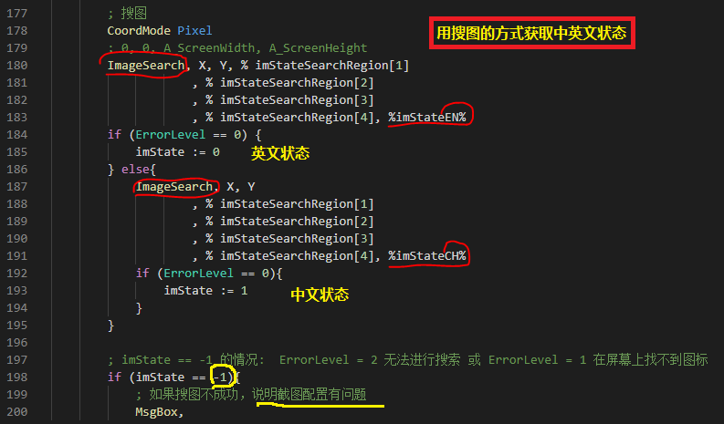

# 输入法助手

> 关于当前上下文的特定输入法的内部中英文状态，现状是不存在可用的API获取方法。
> 
> 上一个版本，通过主动拦截记录中英文状态。缺点是有时存在记录中英文状态和实际的中英文状态不同步。
> 
> 最新版本，分别对中英文两种状态进行截图，然后根据屏幕搜图的方法获取当前上下文的中英文状态
>
> 优点是，通用性极强，适用于任意输入法内部中英文切换，也适用于两个输入法的切换（比如中文键盘和英文键盘间的切换）。
>
> 缺点是，第一次切换前需要截图，如果截图不正确，会提示重新截图。
>
> 本工具是[SharpKnife(利刃)](../README.md)效率工具库的成员



## 假设 或 前置要求

- 假设中英文状态，必须在屏幕上可见（因为本功能依赖屏幕搜图）

- 中英文状态的截图必须能明确区分中英文状态

- 本功能默认 `Ctrl+Space` 进行中英文切换，当然你可以通过ini配置文件修改成您需要的切换快捷键

## 启动

> 建议配置成开机启动

```powershell
git clone https://github.com/chaoskey/SharpKnife.git

# 需要先安装AutoHotkey
autohotkey.exe IMSwitch.ahk
# 或者  下载 https://github.com/chaoskey/SharpKnife/releases
IMSwitch.exe
```

## 配置

默认情况下，程序启动后，会在程序或脚本目录下生成同名ini配置文件。 配置文件一旦生成，将以配置文件为准（可以手工修改指定）。

```ini
[ImSwitch]
; 中英文切换快捷键
SwitchKey=^Space
;
; *50 表示每个像素颜色红/绿/蓝通道强度在每个方向上允许的渐变值
; 更多设置，参考ImageSearch方法的参数ImageFile说明
; https://www.autoahk.com/help/autohotkey/zh-cn/docs/commands/ImageSearch.htm
; 
; 英文状态截图
EN=*50 E:\Work\GitHub\SharpKnife\EN.png
; 中文状态截图
CH=*50 E:\Work\GitHub\SharpKnife\CH.png
;
; key部分以HotKey开头，表示热键
; value中##前的部分：执行的动作，
; value中##后的部分：1表示中文时执行切换，0表示英文时执行切换，-1表示不进行中英文切换
; 确保下面的中英文切换快捷键^{Space}和前面SwitchKey的设置一致
HotKey~+4=^{Space}{bs}{Text}$##1
HotKey~Esc=^{Space}##1
HotKey~+;=^{Space}{bs}{Text}:##1
;
; key部分以HotStr开头，表示热字串，要求和前面的规则一致
HotStr:*?:;zh=^{Space}##0
HotStr:*?:;en=^{Space}##1
;
```
